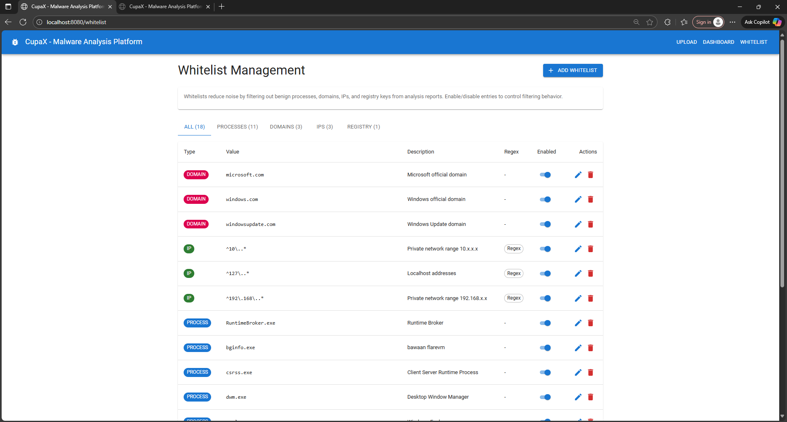

```
   ______                    _  __
  / ____/__  ______  ____ _ | |/ /
 / /   / / / / __ \/ __ `/ |   /
/ /___/ /_/ / /_/ / /_/ / /   |
\____/\__,_/ .___/\__,_/ /_/|_|
          /_/
```

# CupaX - Malware Analysis Sandbox

**Learn about malware behavior in a safe, isolated environment**

CupaX is an open-source malware analysis platform designed for security researchers, students, and defensive security teams. It automatically executes suspicious files in an isolated Windows environment and captures detailed behavioral analysis.


---

## What is a Malware Sandbox?

A **malware sandbox** is an isolated environment where you can safely execute suspicious software to observe what it does without risking your actual systems. Think of it as a "lab in a box" for studying malware behavior.

### Why Use a Sandbox?

**Traditional antivirus** looks for known signatures - like checking if a file matches known bad patterns.

**Dynamic analysis (sandboxing)** actually runs the malware and watches what it does:
- What files does it create, modify, or delete?
- What processes does it spawn?
- What registry keys does it touch?
- What network connections does it make?
- Does it try to persist across reboots?

This reveals the malware's **true behavior** - even if it's never been seen before.

### How CupaX Works

```
┌─────────────────────────────────────────────────────────────────┐
│                        YOUR WORKFLOW                             │
└─────────────────────────────────────────────────────────────────┘

    1. Upload File              2. Detonation              3. Results
         ↓                           ↓                          ↓
   ┌──────────┐              ┌──────────────┐          ┌──────────────┐
   │ Browser  │──────────>   │   Isolated   │          │  Behavioral  │
   │          │   HTTPS      │  Windows VM  │─────────>│   Report     │
   └──────────┘              │  + Procmon   │          └──────────────┘
                             └──────────────┘

         Safe anywhere          ⚠️  Compromised!        Safe to review
```

**The Magic**: CupaX uses **Sysinternals Procmon** (Process Monitor) to capture every system event:
- Process creation
- File system operations
- Registry modifications
- Network activity

This low-level monitoring catches everything the malware tries to do, even if it tries to hide.

---

## Architecture Overview

CupaX uses a **client-server architecture** with three components:

```
┌──────────────────┐         ┌─────────────────┐         ┌──────────────────┐
│   Web Browser    │  HTTP   │  Backend Server │  HTTP   │   Windows VM     │
│                  │◀───────>│                 │◀───────>│                  │
│  - Upload files  │         │  - Go Server    │         │  - Python Agent  │
│  - View reports  │         │  - SQLite DB    │         │  - Noriben       │
│  - Manage lists  │         │  - API + UI     │         │  - Procmon       │
└──────────────────┘         └─────────────────┘         └──────────────────┘
      (You)                     (Any OS)                   (Isolated!)
```

### Component Breakdown

| Component | Technology | Purpose | Where It Runs |
|-----------|-----------|---------|---------------|
| **Frontend** | React + TypeScript | User interface for uploads & reports | Browser (served by backend) |
| **Backend** | Go + SQLite | API server, database, coordination | Any OS (Linux/Mac/Windows) |
| **Agent** | Python Flask | Executes malware, captures events | **Isolated Windows VM** |

**Key Design Principle**: The agent VM is **sacrificial** - it will be compromised by malware. That's why it must be isolated and regularly restored to a clean state.

---

## Features

### 🔍 Behavioral Analysis


Automatically captures and visualizes:
- **Process Tree**: See parent-child relationships and command lines
- **File Operations**: Track file creation, modification, deletion
- **Registry Changes**: Monitor persistence mechanisms
- **Network Activity**: DNS queries, connections, contacted hosts

### 🚀 Easy Deployment


- **Single binary** backend (Go) - no external dependencies
- **Simple agent** (Python Flask) - just install and run
- **Embedded database** (SQLite) - no database server needed
- **Built-in UI** - no separate web server required

### 🗂️ Smart Filtering



- Pre-loaded Windows system process filters
- Custom whitelist rules (process, network, registry)
- Reduces noise from benign system activity
- Focus on actual malicious behavior

### 📦 ZIP Support

Upload password-protected malware archives:
- Automatic extraction with multiple tools (7-Zip preferred)
- Common passwords tried automatically: `infected`, `malware`, `virus`
- Supports advanced compression (Deflate64, LZMA, BZip2)

### 🔄 Proxmox Integration (Optional)

Automatically restore VM to clean snapshot before each analysis:
- One-click VM reset via Proxmox API
- No manual intervention needed
- Guaranteed clean state for every analysis

---

## Quick Start (5 Minutes)

### Prerequisites

**Backend Machine** (any OS):
- Go 1.21+ ([download](https://golang.org/dl/))
- Node.js 18+ ([download](https://nodejs.org/)) - for building frontend

**Agent Machine** (Windows 10/11 VM):
- Python 3.8+ ([download](https://www.python.org/downloads/))
- Noriben framework ([download](https://github.com/Rurik/Noriben))
- Sysinternals Procmon ([download](https://learn.microsoft.com/en-us/sysinternals/downloads/procmon))

### Step 1: Build Backend

```bash
# Clone repository
git clone https://github.com/yourusername/cupax.git
cd cupax

# Build frontend
cd frontend
npm install
npm run build
cd ..

# Build backend
go build -o cupax ./cmd/server

# Generate config file
./cupax --gen-config

# Start server
./cupax
```

Open browser: **http://localhost:8080**


### Step 2: Setup Windows Agent VM

**Install Prerequisites:**
```powershell
# Install Python packages
pip install flask requests

# Download Noriben to C:\noriben\
# Download Procmon to C:\SysinternalsSuite\

# Optional: Install 7-Zip for advanced ZIP support
choco install 7zip
```

**Configure Agent:**
```powershell
# Set Noriben path
set AGENT_NORIBEN_PATH=C:\noriben\Noriben.py

# Set work directory
set AGENT_WORK_DIR=C:\cupax\work

# Start agent
cd cupax\agent
python agent.py
```

Agent will start on **http://0.0.0.0:9090**

### Step 3: Connect Backend to Agent

Edit `cupax.json`:

```json
{
  "analyzer": {
    "enabled": true,
    "agent_url": "http://192.168.1.100:9090",
    "timeout": 600
  }
}
```

Replace `192.168.1.100` with your Windows VM's IP.

Restart backend:
```bash
./cupax
```

**✅ You're ready!** Upload a sample and watch the analysis.

---


## Usage Guide

### Uploading Samples

**Single Executable:**
1. Click "Upload Sample" or drag-and-drop
2. Select `.exe`, `.dll`, `.scr`, `.bat`, or script file
3. Click "Analyze"
4. Wait for completion (typically 5-10 minutes)

**Password-Protected ZIP:**
1. Upload ZIP file
2. Check "This is an infected zip"
3. Enter password (or leave blank to auto-try common passwords)
4. Click "Analyze"

**Via API:**
```bash
# Upload executable
curl -X POST http://localhost:8080/api/v1/analyze \
  -F "file=@malware.exe"

# Upload infected ZIP
curl -X POST http://localhost:8080/api/v1/analyze \
  -F "file=@sample.zip" \
  -F "is_zip=true" \
  -F "zip_password=infected"
```

### Understanding Reports

**Summary Statistics:**
- Total processes created
- Files accessed (read/write/delete)
- Registry operations
- Network connections made

**Process Activity Tab:**
- Process tree showing parent-child relationships
- Full command line arguments
- Process start times
- Detect process injection or hollowing

**File System Tab:**
- Files created (potential payloads, logs)
- Files modified (existing file infection)
- Files deleted (anti-forensics)
- Paths reveal behavior (temp dirs, startup folders)

**Registry Tab:**
- Persistence mechanisms (Run keys, Services)
- Configuration changes
- System modifications

**Network Tab:**
- C2 (Command & Control) servers contacted
- DNS queries (domain generation algorithms)
- Unique IPs and ports
- Protocol patterns

### Managing Whitelists

**Why Whitelist?** Windows generates thousands of benign events. Whitelists filter out noise so you see only malicious activity.

**Pre-loaded filters:**
- `svchost.exe`, `explorer.exe` (legitimate Windows processes)
- Microsoft IP ranges
- Common registry keys

**Add custom filters:**
1. Go to "Whitelist Management"
2. Select type: Process / IP / Domain / Registry
3. Enter value (supports regex)
4. Enable/disable as needed

**Example custom rules:**
```
Process: chrome.exe          (filter browser activity)
IP: 192.168.1.0/24          (filter local network)
Registry: HKLM\SOFTWARE\Policies  (filter policy changes)
```

---

## Security Best Practices

### ⚠️ Critical: Agent VM Isolation

**The agent VM WILL be compromised.** Malware will run with full privileges and can do anything.

### Required Isolation Measures

✅ **Dedicated VM** - Never reuse for other purposes
✅ **Network isolation** - Firewall rules to block internet
✅ **Host-only network** - Agent should only reach backend
✅ **No sensitive data** - Clean Windows install only
✅ **Regular snapshots** - Restore after every analysis (or use Proxmox automation)
✅ **No domain join** - Standalone workgroup machine


### Additional Hardening

1. **Disable Windows Defender** on agent VM (it will interfere with malware execution)
2. **Disable Windows Update** (prevents auto-reboot during analysis)
3. **Use local accounts** (no Microsoft accounts)
4. **Snapshot clean state** (with agent running and ready)
5. **Monitor backend logs** for suspicious activity

### What NOT To Do

❌ Run agent on your workstation
❌ Give agent internet access
❌ Store sensitive data on agent VM
❌ Join agent VM to corporate domain
❌ Use same VM for multiple purposes
❌ Forget to restore VM between analyses

---

## Configuration Reference

### Backend Configuration (`cupax.json`)

```json
{
  "server": {
    "port": "8080",
    "frontend_dir": "./frontend/dist"
  },
  "data": {
    "base_dir": "./data",
    "samples_dir": "./data/samples"
  },
  "analyzer": {
    "enabled": true,
    "agent_url": "http://192.168.1.100:9090",
    "timeout": 600
  },
  "proxmox": {
    "enabled": false,
    "host": "https://proxmox.local:8006",
    "node": "pve",
    "vmid": 100,
    "token_id": "root@pam!cupax",
    "token_secret": "secret",
    "verify_ssl": false,
    "restore_snapshot": true,
    "shutdown_after": true
  }
}
```

| Field | Default | Description |
|-------|---------|-------------|
| `server.port` | 8080 | Web server port |
| `analyzer.enabled` | false | Enable real analysis (false = stub mode for testing) |
| `analyzer.agent_url` | http://localhost:9090 | Agent HTTP endpoint |
| `analyzer.timeout` | 300 | Analysis timeout in seconds |
| `proxmox.enabled` | false | Enable Proxmox VM automation |
| `proxmox.restore_snapshot` | true | Auto-restore VM before analysis |
| `proxmox.shutdown_after` | false | Shutdown VM after analysis |

### Agent Environment Variables

Set before running `python agent.py`:

| Variable | Default | Description |
|----------|---------|-------------|
| `AGENT_NORIBEN_PATH` | Noriben.py | Path to Noriben script |
| `AGENT_PYTHON_PATH` | python | Python interpreter (use "python" on Windows) |
| `AGENT_PORT` | 9090 | HTTP server port |
| `AGENT_HOST` | 0.0.0.0 | Listen address (0.0.0.0 for network) |
| `AGENT_TIMEOUT` | 300 | Analysis timeout (seconds) |
| `AGENT_WORK_DIR` | ./agent_work | Work directory for temp files |
| `AGENT_UNZIP_TOOL` | 7z | ZIP tool: 7z / unzip / python |
| `AGENT_UNZIP_PATH` | 7z | Path to extraction tool |

---

## API Reference

### Upload Sample

```http
POST /api/v1/analyze
Content-Type: multipart/form-data

file: <binary>              [required]
is_zip: "true"              [optional]
zip_password: "infected"    [optional]
```

**Response:**
```json
{
  "id": "123e4567-e89b-12d3-a456-426614174000",
  "filename": "malware.exe",
  "status": "completed",
  "submitted_at": "2024-01-15T10:30:00Z"
}
```

### List Analyses

```http
GET /api/v1/analyses
```

**Response:**
```json
[
  {
    "id": "uuid",
    "filename": "sample.exe",
    "status": "completed",
    "submitted_at": "2024-01-15T10:30:00Z",
    "completed_at": "2024-01-15T10:35:00Z"
  }
]
```

### Get Analysis Report

```http
GET /api/v1/analyses/{id}
```

**Response:** Full analysis report with all events

### Health Check

```http
GET /health
```

**Backend:**
```json
{
  "status": "ok",
  "database": "connected"
}
```

**Agent:**
```http
GET http://agent-vm:9090/health
```
```json
{
  "status": "ok",
  "noriben_path": "C:\\noriben\\Noriben.py",
  "work_dir": "C:\\cupax\\work"
}
```

---


### Backend Logs


Monitor logs for detailed error messages:
```bash
# Run backend in foreground
./cupax

# Look for:
# - Proxmox: <status>
# - Starting analysis for file: <filename>
# - Agent response: <status>
# - Analysis completed successfully
```

---

## Learning Resources

### Understanding Malware Analysis

- **Static Analysis**: Examining code without running it (disassembly, strings)
- **Dynamic Analysis**: Running malware and observing behavior (what CupaX does!)
- **Hybrid Approach**: Combining both methods for complete picture

### Noriben Framework

CupaX uses [Noriben](https://github.com/Rurik/Noriben) which wraps Sysinternals Procmon:
- Captures all process, file, registry, network events
- Filters out known-good Windows activity
- Generates timeline of malware behavior
- Integrates YARA scanning (optional)

### Key Concepts

**Process Injection**: Malware hiding in legitimate processes
- Look for: Unusual processes spawning other processes
- Example: `notepad.exe` starting `powershell.exe`

**Persistence**: How malware survives reboots
- Registry Run keys: `HKLM\Software\Microsoft\Windows\CurrentVersion\Run`
- Scheduled tasks
- Services

**C2 Communication**: Malware calling home
- Look for: Unknown IP addresses, unusual ports
- Domain Generation Algorithms (DGA): Random-looking domains

**Lateral Movement**: Spreading to other systems
- Look for: SMB connections, remote execution

---

## Contributing

We welcome contributions! Areas for improvement:

- Additional event filtering rules
- Better visualization components
- Export formats (PDF, JSON)
- Integration with threat intelligence feeds
- YARA rule scanning
- Memory dump analysis

**How to contribute:**
1. Fork repository
2. Create feature branch
3. Submit pull request with description

---

## Version History

| Version | Key Features | Architecture |
|---------|-------------|--------------|
| v4.0 (current) | Remote agent, Proxmox integration | Client-server HTTP |
| v3.0 | Inline execution | Monolithic |
| v2.0 | File queue system | SQLite + async |
| v1.0 | Initial release | PostgreSQL + Redis |

---

## License

**Apache License 2.0**

Free to use, modify, and distribute. See `LICENSE` file for details.

**Third-party components:**
- [Noriben](https://github.com/Rurik/Noriben) by Brian Baskin (Apache 2.0)
- [Sysinternals Procmon](https://learn.microsoft.com/en-us/sysinternals/) by Microsoft

---

## Disclaimer

**⚠️ For Educational and Research Purposes Only**

CupaX is designed for:
- Security research and education
- Defensive security operations
- Malware analysis training
- Incident response support

**Users are responsible for:**
- Proper isolation of analysis environment
- Compliance with local laws and regulations
- Ethical use of captured malware samples
- Securing analysis infrastructure

**Authors are not responsible for:**
- Misuse of this software
- Damage caused by analyzed malware
- Data breaches due to improper isolation
- Legal issues arising from usage

**Always:**
- Use isolated VMs for analysis
- Obtain proper authorization before analyzing files
- Follow responsible disclosure practices
- Respect intellectual property and privacy

---

## Support & Community

**Issues & Bugs:**
- GitHub Issues: [Report a bug](https://github.com/yourusername/cupax/issues)

**Questions:**
- Check Troubleshooting section above
- Review Noriben documentation
- Search existing GitHub issues

---

## Ready to Analyze?

```bash
# Backend (any OS)
go build -o cupax ./cmd/server && ./cupax

# Agent (Windows VM)
python agent.py

# Open browser
http://localhost:8080
```

**Upload your first sample and explore malware behavior safely!** 🔬🛡️
